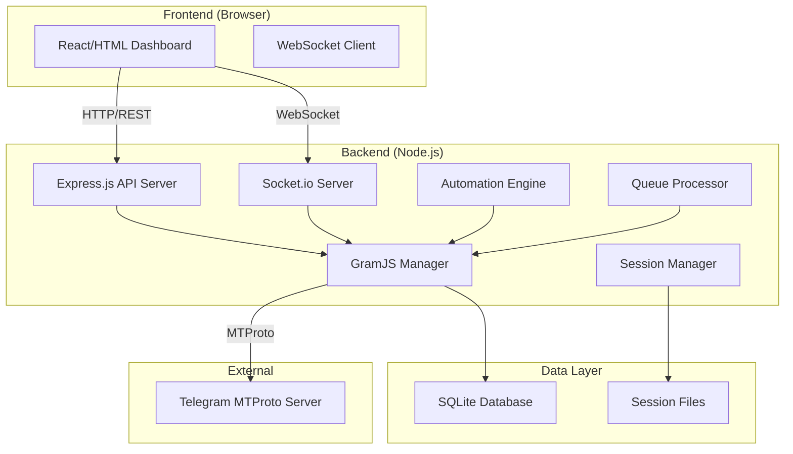

# LiveGramJS - Telegram CRM System Specification

## 1. Project Overview

**Project Name:** LiveGramJS  
**Type:** Web-based Telegram CRM (Userbot Management System)  
**Core Functionality:** Sistem manajemen akun Telegram berbasis web yang memungkinkan pengguna mengelola akun Telegram mereka secara penuh melalui browser dengan fitur automasi pesan, manajemen grup/channel, dan kontrol performa.

**Target Users:** 
- Pebisnis yang membutuhkan automasi客服 Telegram
- Manajemen komunitas grup/channel
- Developer yang ingin akses penuh ke MTProto

---

## 2. Architecture

### 2.1 System Architecture Diagram



### 2.2 Technology Stack

| Component | Technology | Version |
|-----------|------------|---------|
| Runtime | Node.js | 16+ |
| Web Server | Express.js | 4.x |
| MTProto Library | GramJS | Latest |
| Real-time | Socket.io | 4.x |
| Database | better-sqlite3 | Latest |
| Frontend | HTML/JS/Vanilla | - |
| Session Storage | File System | - |

### 2.3 Project Structure

```
LiveGramJS/
├── config/
│   └── config.json          # Konfigurasi sistem
├── src/
│   ├── backend/
│   │   ├── index.js         # Entry point server
│   │   ├── app.js          # Express app setup
│   │   ├── gramjs/
│   │   │   ├── manager.js  # GramJS client manager
│   │   │   ├── session.js  # Session handling
│   │   │   └── events.js   # Event handlers
│   │   ├── api/
│   │   │   ├── auth.js     # Authentication endpoints
│   │   │   ├── account.js  # Account management
│   │   │   ├── chat.js     # Chat operations
│   │   │   ├── group.js    # Group/channel ops
│   │   │   └── automation.js # Automation rules
│   │   ├── automation/
│   │   │   ├── engine.js   # Automation engine
│   │   │   ├── rules.js    # Rule processor
│   │   │   └── triggers.js # Trigger handlers
│   │   ├── queue/
│   │   │   ├── manager.js  # Queue processor
│   │   │   └── limiter.js  # Rate limiter
│   │   └── socket/
│   │       └── handler.js  # Socket.io handlers
│   ├── frontend/
│   │   ├── index.html      # Main HTML
│   │   ├── css/
│   │   │   └── style.css   # Styles
│   │   └── js/
│   │       ├── app.js      # Main app
│   │       ├── api.js      # API client
│   │       ├── socket.js   # Socket client
│   │       └── components/ # UI components
│   └── database/
│       ├── schema.sql      # Database schema
│       └── migrations/     # Migrations
├── sessions/               # Session files storage
├── logs/                   # Log files
├── .env                   # Environment variables
├── package.json
└── README.md
```

---

## 3. Feature Specifications

### 3.1 Authentication & Session Management

#### Login System
- **Input:** Phone number dengan format international (contoh: +62812345678)
- **Process:**
  1. User input phone number
  2. Backend kirim kode verifikasi via GramJS
  3. User input verification code
  4. Backend verifikasi dan buat session
- **Session Storage:** File JSON di folder `sessions/`
- **Session Data:** `{ phone, dcId, serverAddress, authKey, userId }`

#### Multi-Account Support
- Support untuk multiple Telegram accounts
- Switch antar akun dari dashboard
- Setiap akun punya session file sendiri: `sessions/{phone}.json`
- Logout menghapus session file

### 3.2 Account Information

#### Profile Display
- Username
- First name & Last name
- Bio/About
- Avatar (photo URL)
- Phone number
- ID
- Status (online/offline/last seen)

#### Contact List
- Semua kontak dari Telegram
- Info: name, username, phone, avatar
- Search functionality
- Add/remove contact

#### Chat List
- Semua dialog/chat aktif
- Preview pesan terakhir
- Unread count indicator
- Tipe chat (private/group/channel)

#### Groups & Channels
- Daftar semua grup yang diikuti
- Daftar semua channel yang diikuti
- Info: title, members count, username
- Leave functionality

### 3.3 Group & Channel Management

#### Join Group
- Join grup via invite link
- Join grup publik via username
- Tidak perlu jadi admin

#### Create Group
- Buat grup baru
- Set nama grup
- Invite member awal
- Set sebagai admin

#### Channel Management
- Buat channel baru
- Set nama dan deskripsi
- Post konten
- Manage subscribers

#### Leave Group/Channel
- Keluar dari grup/channel manapun
- Tidak perlu jadi admin

### 3.4 Message Automation

#### Auto-Reply System
- **Trigger:** Keyword atau regex pattern
- **Action:** Kirim custom message
- **Conditions:**
  - From specific user
  - In specific chat
  - Time-based (working hours)
- **Configuration:**
  ```json
  {
    "name": "Customer Support Auto-Reply",
    "enabled": true,
    "triggers": [
      { "type": "keyword", "value": "hello" },
      { "type": "regex", "value": "order.*\\d+" }
    ],
    "actions": [
      { "type": "reply", "message": "Hello! How can I help you?" }
    ],
    "conditions": {
      "chatType": "private"
    }
  }
  ```

#### Auto-Forward
- Forward pesan berdasarkan filter
- **Filter Options:**
  - From specific chat
  - Keyword dalam pesan
  - Tipe media (photo, video, document)
- **Destination:** Chat tujuan (group/channel/private)

#### Auto-Post Channel
- Post otomatis ke channel
- **Trigger:** Pesan di grup tertentu
- **Action:** Repost ke channel dengan/sesuai format

#### Dashboard Automation
- Create rule via UI
- Edit existing rules
- Enable/disable rules
- Delete rules
- View execution logs

### 3.5 Chat & History Management

#### Chat History
- Load histori pesan per chat
- Infinite scroll (load 50 pesan per batch)
- Tampilkan: text, media, file, link
- Format waktu: "Hari, Tanggal Jam" (contoh: "Senin, 15 Feb 2026 14:30")

#### Search
- Search dalam histori chat
- Search by keyword
- Filter by date range

#### Message Details
- Sender info
- Timestamp
- Media attachments
- Forwarded from
- Reply to message

#### Read Status
- Indicator pesan sudah dibaca/belum
- Update status via WebSocket

### 3.6 Performance Control

#### Delay System
- Konfigurasi delay per aksi (ms)
- Default: 1000ms antar aksi
- Range: 100ms - 10000ms
- Apply ke: send message, join group, dll

#### Anti-Flood
- Rate limiting: max X request per detik
- Configurable per user/per system
- Auto-pause jika melebihi limit

#### Queue System
- Antrian aksi untuk diproses berurutan
- Priority queue untuk urgent tasks
- Retry mechanism untuk failed tasks

#### Status Indicator
- Loading states
- Progress bars
- Success/error notifications

#### Activity Log
- Semua aktivitas tersimpan
- Timestamp, action, status
- Searchable logs
- Export functionality

### 3.7 Browser Interface

#### Dashboard Layout
```
┌─────────────────────────────────────────────────────┐
│ Header: Logo | Account Switcher | Settings | Logout│
├──────────┬──────────────────────────────────────────┤
│          │                                          │
│ Sidebar  │           Main Content Area             │
│          │                                          │
│ - Chats  │  (Dynamic based on selected menu)       │
│ - Groups │                                          │
│ - Channel│                                          │
│ - Auto   │                                          │
│ - Logs   │                                          │
│          │                                          │
├──────────┴──────────────────────────────────────────┤
│ Footer: Connection Status | Queue Status | Version  │
└─────────────────────────────────────────────────────┘
```

#### Features
- Responsive design (mobile/tablet/desktop)
- Dark/Light mode toggle
- Real-time updates via WebSocket
- Keyboard shortcuts
- Toast notifications

### 3.8 Security

#### Session Encryption
- Session data dienkripsi dengan password
- Menggunakan crypto-js AES encryption
- Password disimpan di config

#### Input Validation
- Sanitize semua input
- Prevent XSS, SQL injection
- Validate phone number format

#### Rate Limiting API
- Max 100 request per menit per IP
- Return 429 jika exceeded

#### Audit Logging
- Semua aksi logged
- Log format: `{ timestamp, userId, action, details }`
- Log rotation

---

## 4. API Endpoints

### 4.1 Authentication
| Method | Endpoint | Description |
|--------|----------|-------------|
| POST | /api/auth/send-code | Kirim kode verifikasi |
| POST | /api/auth/verify | Verifikasi kode |
| POST | /api/auth/logout | Logout dan hapus session |
| GET | /api/auth/status | Cek status login |

### 4.2 Account
| Method | Endpoint | Description |
|--------|----------|-------------|
| GET | /api/account/me | Get profil pengguna |
| GET | /api/account/contacts | Daftar kontak |
| GET | /api/account/chats | Daftar chat |

### 4.3 Groups & Channels
| Method | Endpoint | Description |
|--------|----------|-------------|
| GET | /api/groups | Daftar grup |
| GET | /api/channels | Daftar channel |
| POST | /api/groups/join | Join grup via link |
| POST | /api/groups/create | Buat grup baru |
| POST | /api/groups/leave | Keluar dari grup |
| POST | /api/channels/create | Buat channel |

### 4.4 Messages
| Method | Endpoint | Description |
|--------|----------|-------------|
| GET | /api/messages/:chatId | Get histori pesan |
| POST | /api/messages/send | Kirim pesan |
| GET | /api/messages/search | Search pesan |

### 4.5 Automation
| Method | Endpoint | Description |
|--------|----------|-------------|
| GET | /api/automation/rules | Daftar rules |
| POST | /api/automation/rules | Buat rule baru |
| PUT | /api/automation/rules/:id | Update rule |
| DELETE | /api/automation/rules/:id | Hapus rule |
| POST | /api/automation/rules/:id/toggle | Enable/disable |

### 4.6 System
| Method | Endpoint | Description |
|--------|----------|-------------|
| GET | /api/system/config | Get konfigurasi |
| PUT | /api/system/config | Update konfigurasi |
| GET | /api/system/logs | Activity logs |
| GET | /api/system/stats | Statistics |

---

## 5. WebSocket Events

### 5.1 Client → Server
| Event | Data | Description |
|-------|------|-------------|
| send-message | { chatId, message } | Kirim pesan |
| join-group | { inviteLink } | Join grup |
| leave-group | { chatId } | Keluar grup |
| subscribe | - | Subscribe real-time updates |

### 5.2 Server → Client
| Event | Data | Description |
|-------|------|-------------|
| new-message | Message object | Pesan baru masuk |
| update-chat | Chat object | Chat diupdate |
| connection-status | { status } | Status koneksi |
| automation-triggered | { ruleId, result } | Automation executed |
| queue-update | { pending, processing } | Queue status |

---

## 6. Database Schema

### 6.1 Tables

```sql
-- Sessions table
CREATE TABLE sessions (
    id INTEGER PRIMARY KEY,
    phone TEXT UNIQUE NOT NULL,
    session_data TEXT NOT NULL,
    created_at DATETIME DEFAULT CURRENT_TIMESTAMP,
    last_active DATETIME DEFAULT CURRENT_TIMESTAMP
);

-- Automation rules
CREATE TABLE automation_rules (
    id INTEGER PRIMARY KEY,
    name TEXT NOT NULL,
    type TEXT NOT NULL,
    config TEXT NOT NULL,
    enabled INTEGER DEFAULT 1,
    created_at DATETIME DEFAULT CURRENT_TIMESTAMP,
    updated_at DATETIME DEFAULT CURRENT_TIMESTAMP
);

-- Activity logs
CREATE TABLE logs (
    id INTEGER PRIMARY KEY,
    action TEXT NOT NULL,
    details TEXT,
    status TEXT NOT NULL,
    timestamp DATETIME DEFAULT CURRENT_TIMESTAMP
);

-- Message cache
CREATE TABLE messages (
    id INTEGER PRIMARY KEY,
    chat_id INTEGER NOT NULL,
    message_id INTEGER NOT NULL,
    sender_id INTEGER,
    text TEXT,
    media TEXT,
    timestamp DATETIME DEFAULT CURRENT_TIMESTAMP
);
```

---

## 7. Configuration

### 7.1 config.json

```json
{
  "server": {
    "port": 3000,
    "host": "localhost"
  },
  "telegram": {
    "apiId": "YOUR_API_ID",
    "apiHash": "YOUR_API_HASH"
  },
  "session": {
    "encrypted": true,
    "password": "your-encryption-password"
  },
  "performance": {
    "defaultDelay": 1000,
    "rateLimit": 10,
    "maxRetries": 3
  },
  "security": {
    "apiRateLimit": 100,
    "allowedOrigins": ["http://localhost:3000"]
  }
}
```

---

## 8. Acceptance Criteria

### 8.1 Authentication
- [ ] User dapat login dengan phone number
- [ ] User menerima dan input verification code
- [ ] Session tersimpan dan dapat di-load kembali
- [ ] User dapat switch antar multiple akun
- [ ] Logout menghapus session

### 8.2 Account Features
- [ ] Profil user ditampilkan lengkap
- [ ] Daftar kontak dapat dilihat
- [ ] Daftar grup/channel dapat dilihat
- [ ] Chat list dengan preview pesan

### 8.3 Group Management
- [ ] User dapat join grup via link
- [ ] User dapat buat grup baru
- [ ] User dapat keluar dari grup
- [ ] User dapat buat channel

### 8.4 Automation
- [ ] Auto-reply dengan keyword работает
- [ ] Auto-forward berdasarkan filter работает
- [ ] Dashboard untuk manage rules работает
- [ ] Rules dapat enable/disable

### 8.5 Chat
- [ ] Histori chat dapat di-load
- [ ] Infinite scroll berfungsi
- [ ] Search dalam chat работает
- [ ] Format waktu читабельный

### 8.6 Performance
- [ ] Delay system bekerja
- [ ] Rate limiting bekerja
- [ ] Queue processor работает
- [ ] Activity logs tersimpan

### 8.7 UI/UX
- [ ] Dashboard dapat diakses di browser
- [ ] Real-time updates bekerja
- [ ] Dark/light mode работает
- [ ] Responsive di berbagai ukuran layar

---

## 9. Dependencies

### 9.1 Required Packages

```json
{
  "dependencies": {
    "express": "^4.18.2",
    "gramjs": "^2.2.1",
    "socket.io": "^4.7.2",
    "better-sqlite3": "^9.2.2",
    "crypto-js": "^4.2.0",
    "dotenv": "^16.3.1",
    "cors": "^2.8.5",
    "express-rate-limit": "^7.1.5"
  }
}
```

---

## 10. Installation & Usage

### 10.1 Prerequisites
- Node.js 16+
- Telegram API ID & Hash (dari my.telegram.org)

### 10.2 Installation
```bash
# Clone atau download project
cd LiveGramJS

# Install dependencies
npm install

# Konfigurasi
cp config/config.example.json config/config.json
# Edit config.json dengan API ID dan Hash

# Jalankan server
npm start
```

### 10.3 Akses
Buka browser: http://localhost:3000

---

*Document Version: 1.0*  
*Last Updated: 2026-02-15*
